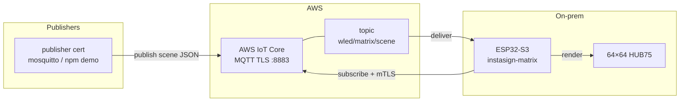

# Instasign

Firmware for driving a **64×64 HUB75 RGB matrix** on the **Seengreat RGB Matrix HUB75 S3** (ESP32-S3-WROOM-1-N16R8).

This repository is a **fork of [WLED](https://github.com/wled/WLED)**. We keep the WLED core and web UI, then layer on board-specific pinout, defaults, and a `matrix_display` usermod that treats the panel as a small sign: notification / warning scenes over MQTT (including AWS IoT Core over TLS), not as a generic LED-strip controller.

## What is different from upstream WLED

- **Hardware target**: Seengreat HUB75 pin mapping (`SEENGREAT_RGB_MATRIX_S3_PINOUT`), FM6126A panel init, 64×64 first-boot defaults
- **Build env**: `seengreat_rgb_matrix_s3` in `platformio_override.ini` (PlatformIO + Tasmota Arduino-ESP32)
- **`usermods/matrix_display`**: scene JSON over MQTT/HTTP, fonts/icons, multi-scene queues
- **TLS for AWS IoT**: vendored `NetworkClientSecure` + full mbedTLS client libs (`lib/mbedtls_esp32s3/`), because the stock Tasmota framework ships a stub `libmbedtls.a` without usable client/PEM support
- Core WLED MQTT stays off on this IDF5 path; the usermod owns the MQTT client when IoT secrets are present

Device certificates and private keys are **not** in this repo. Generate them separately and place them under `usermods/matrix_display/secrets/` (see `.gitignore`).

## Cloud MQTT

Scenes are published to **AWS IoT Core** over MQTT/TLS (port 8883). The board connects as an IoT Thing (`instasign-matrix`), subscribes to `wled/matrix/scene`, and renders JSON payloads on the panel. A separate publisher certificate is used for demos and tooling (same account, publish-only policy).



CDK for the IoT Things, policies, and cert provisioning lives outside this firmware repo (`InstasignMqttStack`).

## Build / flash

```bash
pio run -e seengreat_rgb_matrix_s3
pio run -e seengreat_rgb_matrix_s3 -t upload
```

Default PlatformIO env is already `seengreat_rgb_matrix_s3`. You need PlatformIO and a USB connection to the board.

## Upstream

Everything not listed above is still WLED — effects, JSON API, OTA, and the rest of the community firmware. Docs for that layer: [kno.wled.ge](https://kno.wled.ge).

Licensed under the same terms as WLED (**EUPL v1.2**). Credit to [Aircoookie](https://github.com/Aircoookie) and the [WLED maintainers](https://github.com/wled/WLED).
